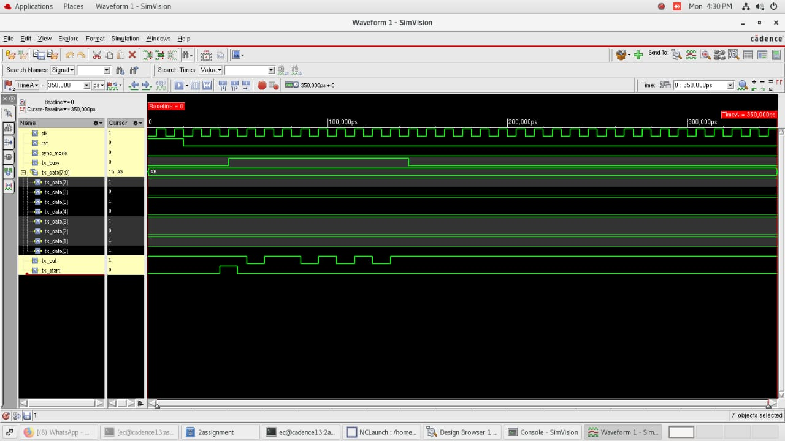
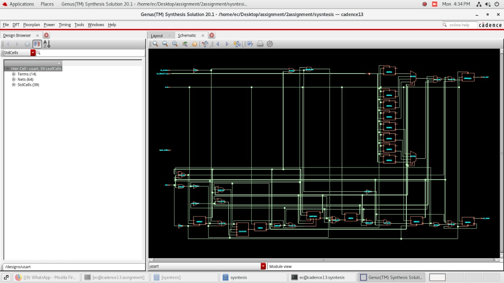

# USART_VerilogDesign
Verilog-based USART transmitter design with functional verification and Cadence synthesis analysis.
# USART Verilog Design

## Overview

This project implements a USART (Universal Synchronous/Asynchronous Receiver Transmitter) transmitter using Verilog HDL. The design converts 8-bit parallel data into serial data using start, data, and stop bits.

The transmitter was functionally verified using a Verilog testbench and synthesized using Cadence tools with area and timing constraints.

## Features

- 8-bit parallel data input
- Serial data transmission
- Start bit generation
- 8 data bits
- Stop bit generation
- Transmission busy indication
- Functional verification using a testbench
- Cadence synthesis and constraint analysis

## Design

The USART transmitter uses a state-based design consisting of:

- Idle state
- Start-bit transmission
- Data-bit transmission
- Stop-bit transmission

The transmission timing is controlled using `CLK_PER_BIT`.

## Tools Used

- Verilog HDL
- Cadence tools
- RTL Simulation
- Logic Synthesis

## Files

| File | Description |
|------|-------------|
| `usart_tx.v` | USART transmitter RTL |
| `tb_usart_tx.v` | USART transmitter testbench |
| `usart_waveform.jpg` | Simulation waveform |
| `usart_synthesis.jpg` | Cadence synthesis result |

## Functional Verification

The USART transmitter was verified using a Verilog testbench. The testbench applies sample data `8'hA5`, generates the clock, applies reset, starts the transmission, and observes the transmitter operation. :contentReference[oaicite:0]{index=0}

### Simulation Waveform

## Cadence Synthesis

The USART transmitter was synthesized using Cadence tools with suitable area and timing constraints. The synthesized design was analyzed for area, power, delay, and critical-path characteristics. :contentReference[oaicite:1]{index=1}

### Synthesis Result

## Result

The USART transmitter was successfully implemented in Verilog and functionally verified using a testbench. The design was synthesized and analyzed using Cadence tools.

## Key Learning

- RTL design using Verilog
- USART transmitter architecture
- Testbench development
- Functional verification
- RTL synthesis
- Timing and area constraints
- Critical-path analysis
